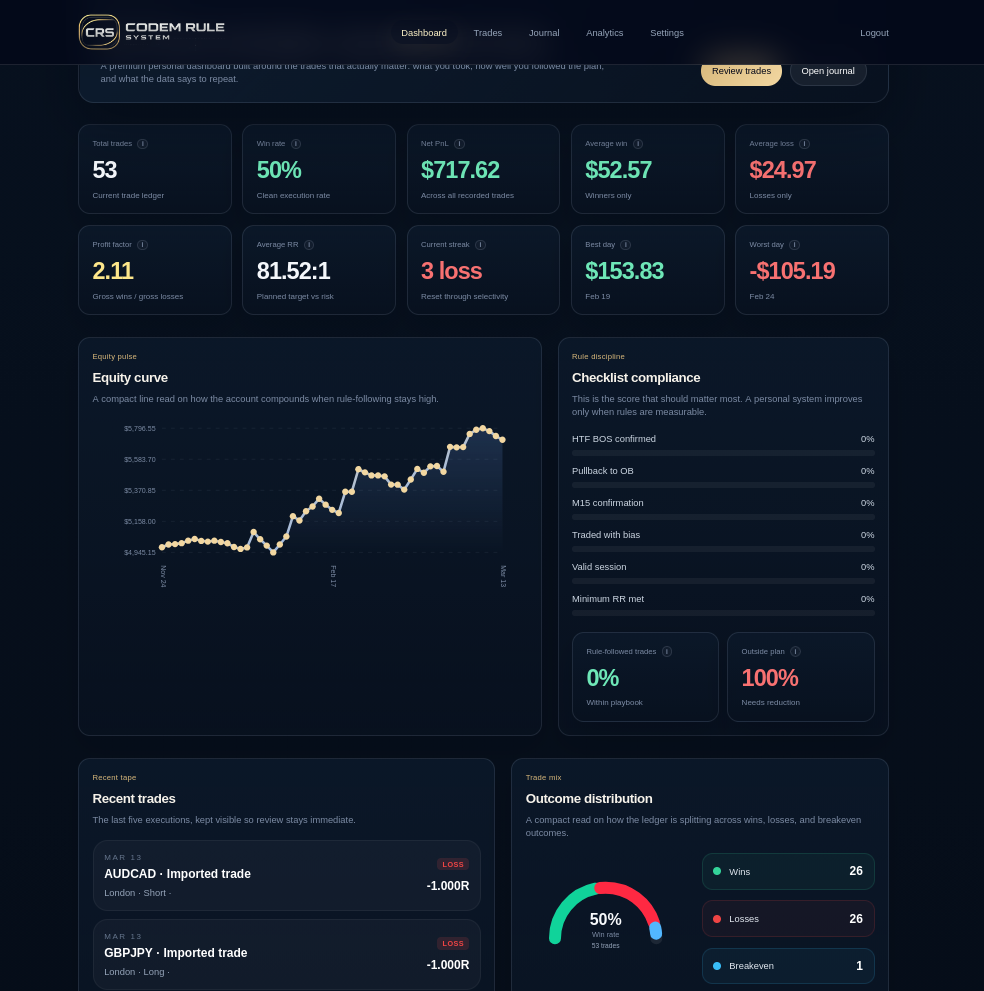
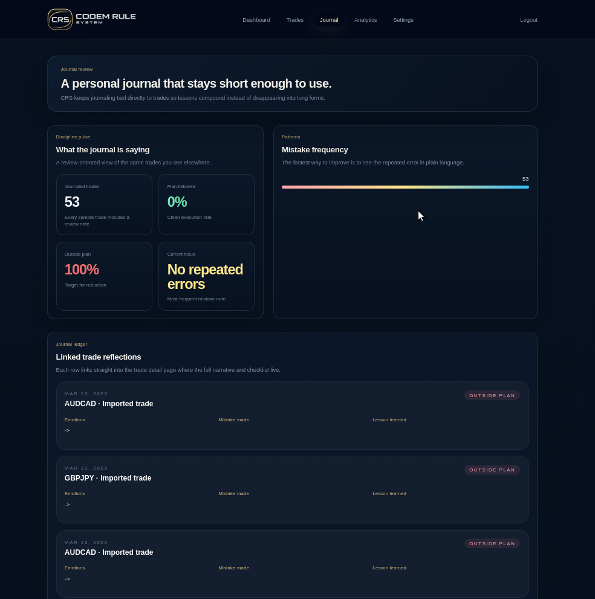

<p align="center">
  
</p>

<p align="center">
  A focused trading journal for execution review, disciplined trade logging, and practical analytics.
</p>

<p align="center">
  <a href="docs-site/docs/index.md">Docs</a> ·
  <a href="backend/docs/LOCAL_SETUP.md">Local Setup</a> ·
  <a href="docs-site/docs/operations/deployment.md">Deployment</a> ·
  <a href="config/siteIdentity.json">Site Identity</a>
</p>

<p align="center">
  
  
  
  
  
</p>

## Overview

CRS Codem System Rule is a personal trading dashboard built around one workflow:

- record trades
- review execution
- measure discipline
- refine a rule-based system without platform clutter

Created by Keith Odera, Founder & Developer of CRS.

Current release:

- Version `2.2.0`
- Stage `Beta`
- Premium billing is planned for a later v2 release

Shared public identity values live here:

- [`config/siteIdentity.json`](config/siteIdentity.json)
- [`config/release.json`](config/release.json)
- [`config/README.md`](config/README.md)

## Product Surfaces

The active CRS product is intentionally narrow:

- Dashboard
- Trades
- Journal
- Analytics
- Settings
- Admin Center

## Product Preview

<p align="center">
  
</p>

<p align="center">
  
</p>

## Current Direction

What is already in place:

- CRS-first app shell and branding
- real trade persistence wired into the backend
- CRS-native and broker-style CSV import/export
- duplicate protection across frontend, backend, and database
- admin controls for users, backups, and registration mode
- branded Docusaurus docs site

What still remains:

- deeper cleanup of remaining legacy-branding pages and services
- broader backend test coverage and final hardening
- final live deployment wiring and domain setup
- premium billing and subscription flow in a later v2 pass

## Stack

| Layer | Tools |
| --- | --- |
| Frontend | Vue 3, Vite, Pinia, Vue Router, Tailwind |
| Backend | Node.js, Express |
| Database | PostgreSQL |
| Docs | Docusaurus |
| Local DB workflow | Docker Postgres |

## Local Setup

The clean local CRS layout is:

- frontend on `5173`
- backend on `3000`
- Postgres in Docker on `5433`
- Adminer on `8080`

### 1. Start Postgres

```bash
docker compose -f docker-compose.dev.yaml up -d postgres
```

### 2. Start the backend

```bash
cd backend
npm run dev
```

### 3. Start the frontend

```bash
cd frontend
npm run dev -- --host 0.0.0.0
```

Open:

- app: `http://localhost:5173`
- docs: `http://localhost:3001`

For the complete setup flow, use:

- [`backend/docs/LOCAL_SETUP.md`](backend/docs/LOCAL_SETUP.md)
- [`docs-site/docs/getting-started/local-setup.md`](docs-site/docs/getting-started/local-setup.md)

## Documentation

A dedicated docs site lives in [`docs-site`](docs-site).

Run it locally:

```bash
cd docs-site
npm install
npm run start
```

Key docs:

- [`docs-site/docs/index.md`](docs-site/docs/index.md)
- [`docs-site/docs/workflows/import-export.md`](docs-site/docs/workflows/import-export.md)
- [`docs-site/docs/operations/deployment.md`](docs-site/docs/operations/deployment.md)
- [`docs-site/docs/operations/go-live-checklist.md`](docs-site/docs/operations/go-live-checklist.md)
- [`docs-site/docs/operations/release-process.md`](docs-site/docs/operations/release-process.md)

Release workflow:

```bash
node scripts/sync-release-version.js
```

## Identity, Domains, and Contact

Update these before public launch:

- support email
- app domain
- docs domain
- privacy URL
- terms URL

Main files:

- [`config/siteIdentity.json`](config/siteIdentity.json)
- [`backend/.env.production.example`](backend/.env.production.example)

Current support contact:

- `support@codemrs.site`

## Deployment Notes

The recommended live layout for the current repo is:

- frontend on Vercel
- docs site on Vercel as a separate project
- backend and Postgres on a VPS or another Node-friendly host

Deployment guidance:

- [`docs-site/docs/operations/deployment.md`](docs-site/docs/operations/deployment.md)
- [`docs-site/docs/operations/go-live-checklist.md`](docs-site/docs/operations/go-live-checklist.md)

## Project Intent

CRS is not meant to remain a broad social trading platform. The target product is a personal, rule-based journaling and analytics system centered on:

- execution quality
- discipline tracking
- setup review
- account-aware risk
- clean trade logging

That direction should guide the remaining refactor work.
